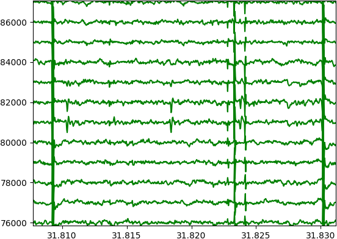
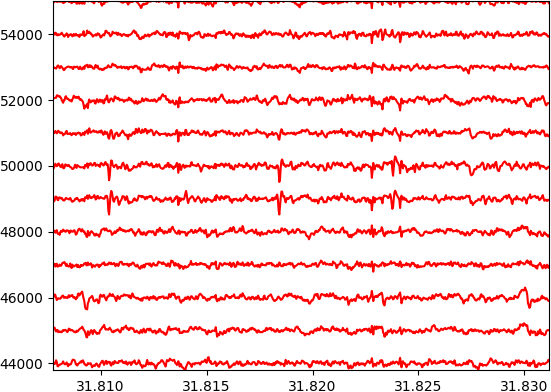
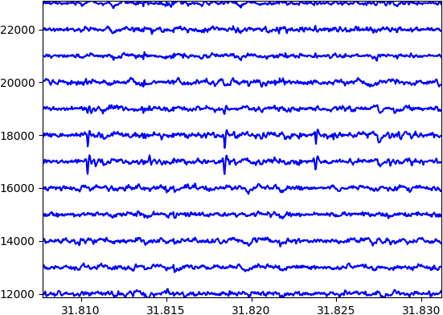

# Neural Artifact Removal (NAR)

The Neural Artifact Removal (NAR) algorithm is an automated
artifact removal for electro-physiological recordings

Inspired on this work [1] this algorithm uses also SWT with haar window to detect and remove artifact.

Differences with [1] are:

- Automatic thresholds
- Preserve waveform shape
- Parallel computing
- Multi channel information

## Results

Figure (a) shows 16 channels from motor cortex of a Long-Evans rat in a freely moving auditory discrimination task.
Figure (b) shows same channels after artifact removals channel by channel.
Figure (c) shows the effect of using multiple channels to determine the presence of artifacts.

## Validation

Validation of this code has been done using public datasets [2-4].

## Cite this work

If you find this code useful please cite, for the moment, this repository. A publication is on the way.

## References

[1] Islam (2014) [DOI](https://doi.org/10.1016/j.jneumeth.2014.01.027).

[2] Yger (2018) [DOI](https://doi.org/10.7554/eLife.34518).

[3] Neto (2016) [DOI](https://doi.org/10.1152/jn.00103.2016).

[4] Petersen (2020) [DOI](https://doi.org/10.5281/ZENODO.3629880).
